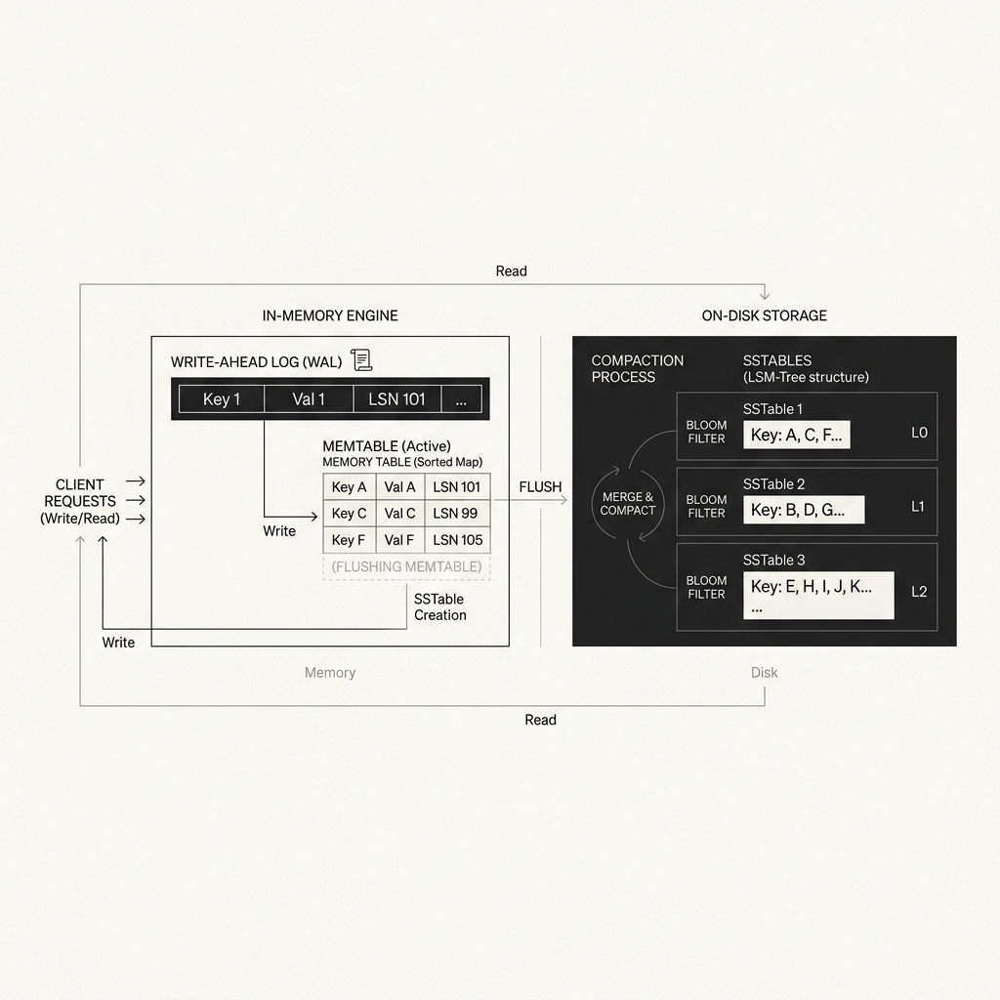
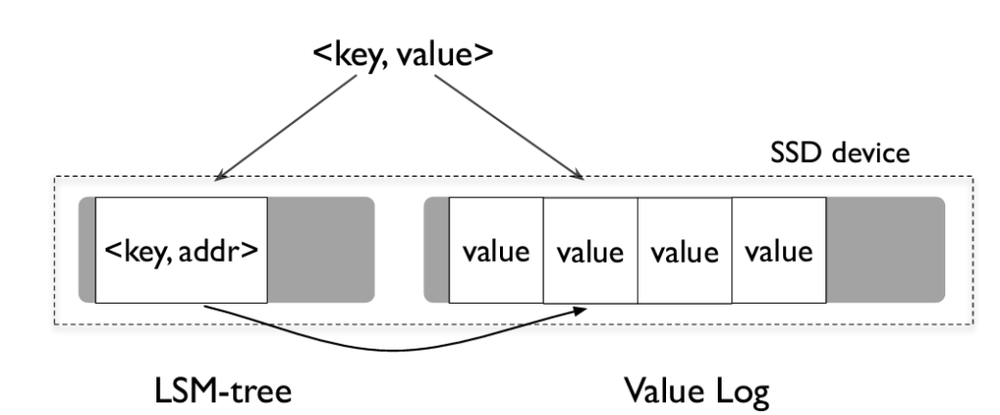
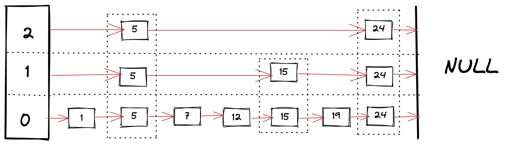
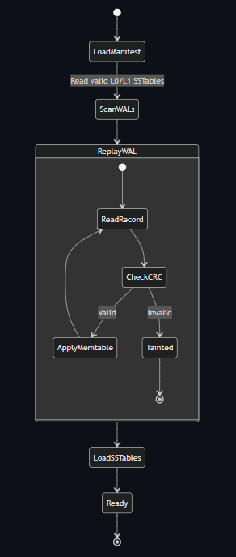
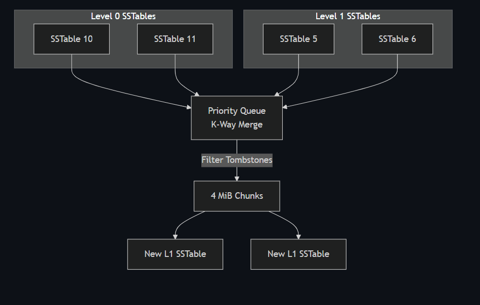

# ForgeLSM

**A high-performance embedded C++20 key-value storage engine featuring WiscKey key-value separation, lock-free concurrency, and single-key ACID durability.**

ForgeLSM was developed from the ground up to mitigate the severe Write Amplification and I/O bottlenecks inherent in traditional Log-Structured Merge Trees (LSM-Trees). By physically decoupling keys from large values, integrating a lock-free Skip List Memtable, and utilizing a zero-copy Value Log, the engine achieves near-optimal write endurance for large payloads while scaling highly concurrent synchronous ingestion.

---

## 🏛️ System Architecture

<p align="center">
  
</p>

ForgeLSM relies on a hybrid architecture designed to keep the hot path lock-free and reduce background I/O contention:

### 1. WiscKey Key-Value Separation
Traditional LSM-trees (like RocksDB or LevelDB) rewrite large values repeatedly during background compactions, causing massive Write Amplification. ForgeLSM adopts the **WiscKey** paradigm: 
Keys and compact metadata (a 16-byte `VLogPointer`) remain in a strictly leveled 6-tier LSM-Tree (L0 through L5), while the actual values are appended sequentially to a separate **Value Log (VLog)**.

<p align="center">
  
</p>

### 2. Lock-Free Memtable & Monotonic Arena
The primary ingestion bottleneck is resolved using a custom lock-free `ConcurrentSkipList` as the Memtable. Updates use atomic Compare-And-Swap (CAS) instructions with strict acquire/release semantics.
To eliminate the `std::map` allocator overhead and avoid the ABA problem, ForgeLSM utilizes a monotonic **Arena Allocator**. The Arena pre-allocates contiguous memory slabs, avoiding use-after-free defects by safely detaching the entire Arena only after the Memtable flushes to disk.

<p align="center">
  
</p>

### 3. Reliability: Group Commit & MVCC
ForgeLSM enforces **Single-Key ACID** durability and **Snapshot Isolation** for reads.
- **Group Commit**: To amortize the extreme latency of physical `fsync` boundaries, concurrent writer threads are batched into a single physical NVMe flush via a leader-follower protocol. 
- **MVCC**: Background compactions and garbage collections never block active readers, ensuring steady microsecond-scale point-in-time reads.

*(Note: ForgeLSM provides a convenience `PutBatch` API, but it does not natively support multi-key transactional atomicity or rollbacks.)*

<p align="center">
  
</p>

### 4. Background Compaction & Garbage Collection
Overlapping SSTables are merged using a priority-queue-based $K$-way merge. Because the VLog is append-only, deleted or overwritten records leave "dead" space on the SSD. A concurrent **Garbage Collection (GC)** thread sequentially scans the VLog and rewrites surviving live values. 
To prevent race conditions where a user overwrites a key while the GC is relocating it, GC pointer updates are routed directly through the primary lock-free write queue via an `is_gc` flag.

<p align="center">
  
</p>

---

## 📊 Empirical Benchmarks

The empirical evaluation of ForgeLSM validates the theoretical models against local NVMe SSD hardware using an Intel Core i5-12500H processor (12 cores, 16 threads).

### WiscKey Write Amplification Factor (WAF)
Traditional LSM-trees suffer WAFs approaching 30×. By keeping values out of the compaction cycle, ForgeLSM systematically drives WAF down to near-optimal limits for large payloads.

| Payload Size | WAF (Measured/Estimated) |
| :--- | :--- |
| **64 bytes** | 18.13× |
| **256 bytes** | 6.38× |
| **1 KB** | 2.43× |
| **4 KB** | 1.36× (Estimated) |
| **16 KB** | 1.09× (Estimated) |

The cost model accurately derives a base $N=30$ WAF constant from the 6-level architecture ($T=10$, $K_{L0}=4$).

### Industry-Standard YCSB Workloads
Workloads were executed with **16 concurrent worker threads** using **strict synchronous durability (`sync_writes = true`)**. Results are the mean of 5 independent trials.

| Workload Profile | Mean Ops/sec (±σ) | p50 (µs) | p99 (µs) |
| :--- | :--- | :--- | :--- |
| **A: Update-heavy (50R/50W)** | 3,739 ± 182 | 2,506 | 43,087 |
| **B: Read-heavy (95R/5W)** | 77,289 ± 2,140 | 9 | 3,225 |
| **C: Read-only (100% reads)** | 779,738 ± 11,500 | 7 | 185 |
| **D: Read-latest (95R/5 inserts)** | 48,965 ± 1,650 | 10 | 2,814 |
| **E: Range scans (95% scan/5W)** | 1,269 ± 84 | 9,166 | 66,651 |
| **F: Read–modify–write (50% RMW)** | 7,374 ± 315 | 1,879 | 8,437 |

*Note: Workloads A and F are heavily bounded by hardware physical NVMe synchronization latency. When running asynchronously from cache, single threads easily exceed 500,000+ ops/sec.*

### Group Commit Scaling
Under strict synchronous `fsync` conditions, the lock-free Group Commit batching achieves a **20.98× speedup**.

| Active Threads | Mean Throughput (ops/sec) | Speedup |
| :--- | :--- | :--- |
| **1** | 508 ± 21 | 1.00× |
| **16** | 4,137 ± 190 | 8.14× |
| **64** | 10,659 ± 480 | 20.98× |

### Edge Case Limitations (Honest Trade-offs)
- **Zero-I/O Bloom Filters:** Configured for a **98.9%** theoretical rejection rate. In missing-key benchmarks, they successfully bypassed 1,000,000 VLog reads, achieving a measured **94.37%** SSTable block-search avoidance (reflecting the compounded effect of querying multiple independent filters across levels).
- **True Cold-Disk Reads:** When OS page caches were intentionally wiped, purely physical NVMe reads stabilized at **40,523 ± 2,200 ops/sec**.
- **Garbage Collection "Compaction Storm":** During worst-case, deliberately adversarial continuous active GC runs, foreground throughput degrades by up to **95.6%** (dropping from ~66k to ~2.8k ops/sec). Because ForgeLSM operates without I/O limits on the background thread, aggressive SSD space reclamation effectively saturates hardware queue depth, heavily starving the foreground writer. *Future work targets implementing an I/O Rate Limiter to cap GC bandwidth to 20% of disk capacity.*

---

## 🚀 Building and Running

ForgeLSM is built natively with CMake and `g++` (GCC 13+ or MinGW-w64). It leverages `#ifdef _WIN32` for platform-specific optimizations like `MapViewOfFile` vs `mmap`.

### Quick Start (Windows)
```powershell
# Compile the static library and all demos/benchmarks
.\build.ps1

# Run the interactive CRUD REPL demo
.\build\demos\demo_crud.exe
```

### Quick Start (Linux)
```bash
mkdir build && cd build
cmake -DCMAKE_BUILD_TYPE=Release ..
make -j$(nproc)
```

The compiled binaries will be available in the `build/benchmarks/` and `build/demos/` directories.
